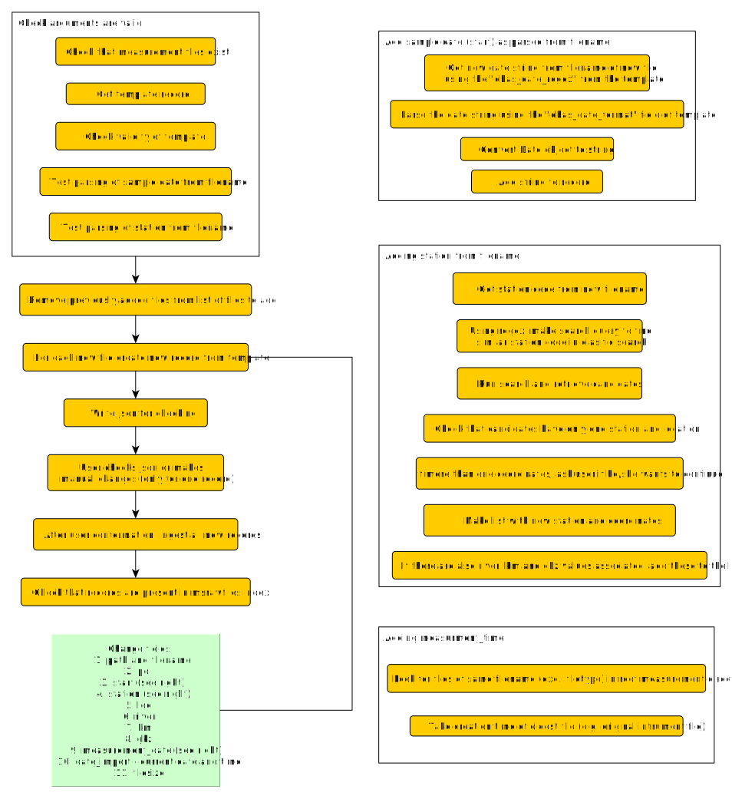
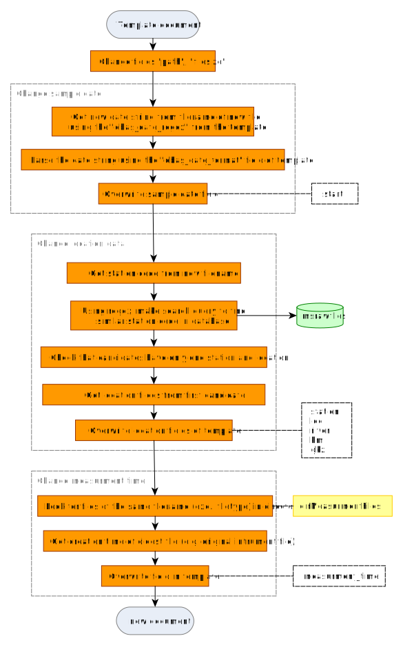

```{r, include = FALSE}
knitr::opts_chunk$set(
  collapse = TRUE,
  comment = "#>"
)
```

`addRawfiles()` creates a new entry in the `msrawfiles` table. It uses an existing document as a template and dynamically changes certain fields based on data encoded in the filename or directly passed by the user. More details are found in the `addRawfiles()` documentation.

# Step-by-step guide to using `addRawfiles()`

1. Install the newest version of *ntsportal*, including the Python requirements.
2. First, create a backup of `msrawfiles`. Use the function `createBackupMsrawfiles()`, a backup named `ntsp25.2_msrawfiles_backup_<YYYYMMDD>` is then created.

```{r, eval=FALSE}
library(ntsportal)
connectNtsportal()

rfIndex <- "ntsp25.2_msrawfiles"

createBackupMsrawfiles(rfIndex)
```

3. Find the new mzXML measurement files - e.g. with Windows Explorer
- If necessary, move files to the correct storage location[^storage-bfg].
- Each batch (measurement sequence) is stored in its own directory. If batches become larger than ca. 60 files they should be split into several batches.

[^storage-bfg]: At the BfG, mzXML files are stored together with the original vendor files on a (slow) network attached storage (NAS). Only the mzXML are synchronized to a fast storage (BeeGFS). The BeeGFS path is added to `msrawfiles`. However, the `dirMeasurmentFiles` argument has to be in the original vendor file location on the NAS, since only mzXML files are transferred to BeeGFS.

4. Go to RStudio

- Get the ID of a document to use as a template for the files you want to add either by using the Dev Tools console or `findTemplateId()`:
```{r, eval=FALSE}
templateId <- findTemplateId(rfIndex, blank = F, pol ="pos", station = "rhein_ko_l", matrix = "water", duration = 1)
```

- Get a vector of paths for the files to be added. In this case the positive measurement files of samples (not blanks)  
```{r, eval=FALSE}
pathsToAdd <- list.files(
  path = "/beegfs/nts/ntsportal/msrawfiles/koblenz/wasser/2024/202406/pos/", 
  pattern = "RH_pos_\\d{8}\\.mzXML", full.names = TRUE)
```

- Run `addRawfiles()`
```{r, eval=FALSE}
addRawfiles(
  rfIndex = rfIndex, 
  templateId = templateId, 
  newPaths = pathsToAdd,
  dirMeasurmentFiles = "~/Messdaten/koblenz/wasser/2024/202406/pos/wiff/"
)
```

- Use the `dirMeasurmentFiles` argument to specify where to look for the original (vendor format) measurement files (root directory is sufficient). This is used to get the measurement time since this is not always written in the mzXML file, e.g. when converting wiff files[^storage-bfg].

5. Check `add-rawfiles-check.json` (e.g., `start`, `filename`, `pol` and `blank` fields)
- If you want to make changes to `add-rawfiles-check.json`, these can be accepted only if you are adding one file (run `addRawfiles()` with just one file in the `newPaths` argument)
6. When prompted in the console, enter `y` when okay / `n` when not okay / `c` if you have made changes to the JSON (remember to save the JSON beforehand)
7. Add the next set of files, in this example the blanks in the same batch are added:

```{r, eval=FALSE}
blanksToAdd <- list.files(
  path = "/beegfs/nts/ntsportal/msrawfiles/koblenz/wasser/2024/202406/pos/", 
  pattern = "MQ", full.names = TRUE)
blankID <-  findTemplateId(rfIndex, blank = TRUE, pol ="pos", station = "rhein_ko_l", matrix = "water", duration = 1)
addRawfiles(
  rfIndex = rfIndex, 
  templateId = blankID, 
  newPaths = blanksToAdd,
  dirMeasurmentFiles = "~/Messdaten/koblenz/wasser/2024/202406/pos/wiff/"
)
```

8. Check coherency of `msrawfiles`. This step takes a few minutes, so it is recommended only after all files have been loaded. 

```{r, eval=FALSE}
checkMsrawfiles(rfIndex)
```

# Function description

The function is designed to make adding new files to `msrawfiles` as quick and error-free as possible. It works by copying existing documents in `msrawfiles` as templates and changing certain fields.

{width=100%}
{width=100%}

# Special cases

## The files being added have different measurement locations

`addRawfiles()` can dynamically change The location for each entry based on the location encoded in the filename. The field `dbas_station_regex` in the template document is used to find documents from a matching location from existing entries in `msrawfiles`. The location information is then copied from these documents (`station`, `loc`, `river`, `km` and `gkz` fields).

Use `newStation = "filename"` to copy location information from other entries
```{r, eval=FALSE}
addRawfiles(rfindex, "eIRBnYkBcjCrX8D7v4H5", newFiles[4:17], newStation = "filename", 
             dirMeasurmentFiles = "~/messdaten/sachsen/") 
```
Example `filename`: `OBF34910_20230821_Zschopau_pos.mzXML`  
Example `dbas_station_regex`: `^(OBF\\d{5})_`


<!-- Copyright 2025 Bundesanstalt für Gewässerkunde -->
<!-- This file is part of ntsportal -->
