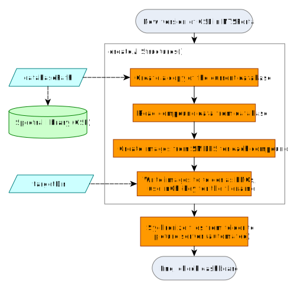

```{r, include = FALSE}
knitr::opts_chunk$set(
  collapse = TRUE,
  comment = "#>"
)
```

# Spectral library dashboard

## Structural formula visualization

A VEGA graphic retrieves the image based on the first inchikey provided by the Kibana search context. Structures are rendered asynchronously. The structures are saved as PNG files and sychronized to the image server at `picture.ntsportal.bafg.de`. This process must be started by the NTSPortal administrator when a new CSL version is used in NTSPortal.

The function `createAllStructures` creates the structural formulas of all compounds in the CSL. It consists of 5 steps:

1. Optional: To avoid accidental manipulation on the CSL database, a copy is created in the working directory.
2. The compound list is extracted from the SQlite `.db` file with the help of the `RSQlite` package.
3. The SMILES code of each compound is converted to a structural formula with the `rcdk` package (requires `rJava`).
4. The formulas are exported as `.png` files to a folder synchronized with the picture server, from where they can be accessed by Kibana. The file names are the InChiKeys of the substances.
5. Optional: The copy of the CSL is removed from the working directory.

{width=100%}
