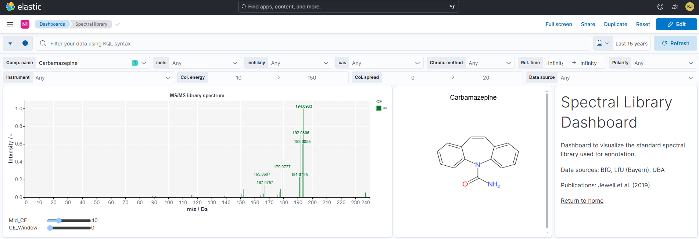

```{r, include = FALSE}
knitr::opts_chunk$set(
  collapse = TRUE,
  comment = "#>"
)
```

# Spectral library dashboard

## Structural formula visualization

{width=100%}

### Front-end logic

A custom, *Vega-lite* Kibana visualization retrieves a PNG image of a structural formula from `picture.ntsportal.bafg.de` and renders it. The correct structure is chosen based on the first document provided by the Kibana search context. The `inchikey` field is extracted from the document and used to build a URL which points to the correct structure. For example, Edetol is at `https://picture.ntsportal.bafg.de/NSOXQYCFHDMMGV-UHFFFAOYSA-N.png`.

{width=20%}

### Back-end infrastructure

The PNGs are written asynchronously by `ntsportal::createAllStructures()` to the picture server. The PNG files are first saved to a designated folder and from there synchronized automatically to the image server. `createAllStructures()` produces the structural formulas of all compounds in the CSL as PNGs. The PNGs must be updated with this function by the NTSPortal administrator when a new CSL version is used in NTSPortal.

`createAllStructures` consists of 4 steps:

1. A copy of the CSL at `databasePath` is created in a temporary directory.
2. The compound list is extracted from the SQlite `.db` file with the help of the `RSQlite` package.
3. The SMILES code of each compound is converted to a structural formula with the `rcdk` package (requires `rJava`).
4. The formulas are exported as `.png` files to the `targetDir` -- best a folder synchronized with the picture server, from where they can be accessed by Kibana. The file names are the InChiKeys of the substances.

{width=100%}

<!-- Copyright 2025 Bundesanstalt für Gewässerkunde -->
<!-- This file is part of ntsportal -->
