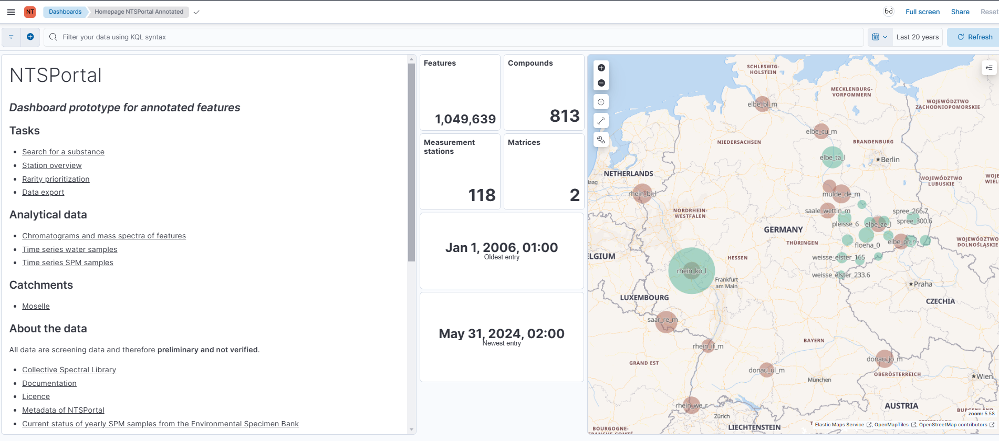
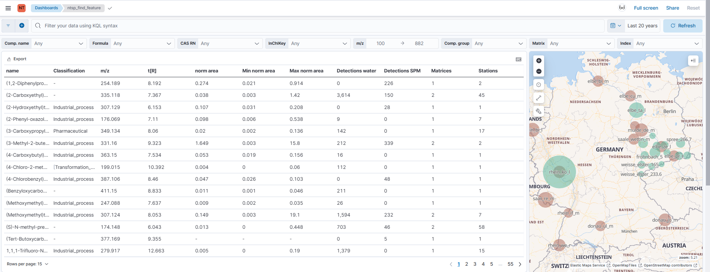
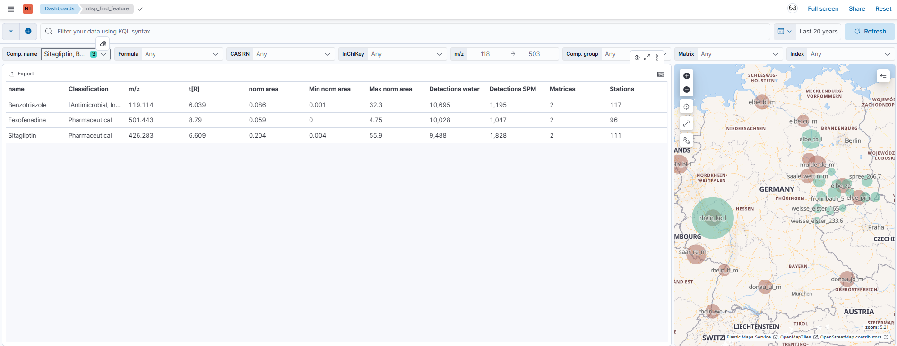
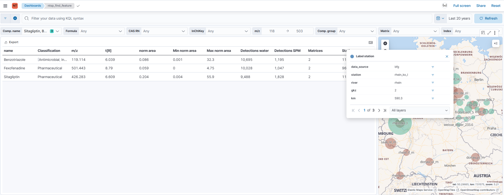
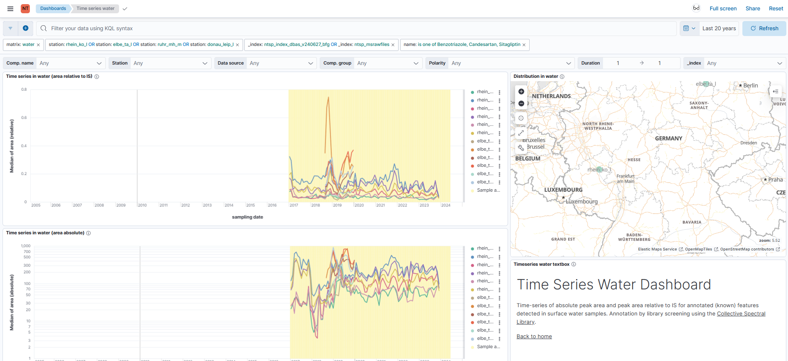
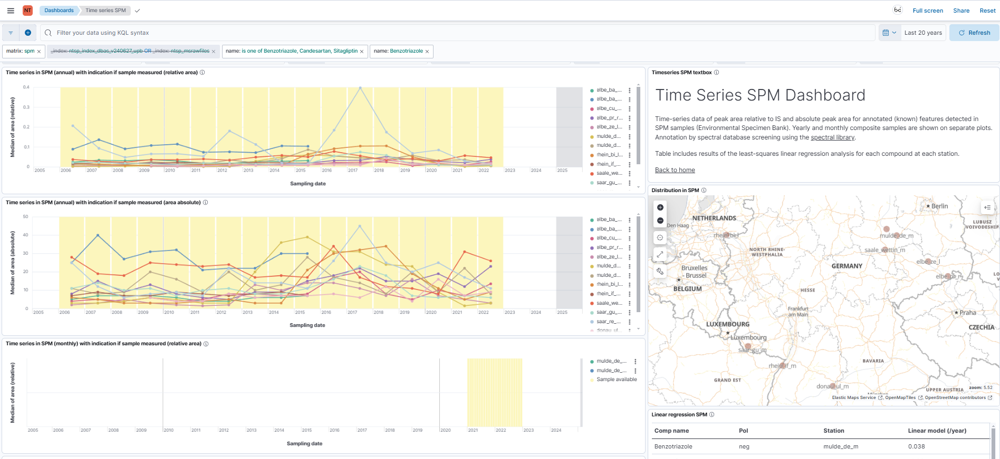

```{r, include = FALSE}
knitr::opts_chunk$set(
  collapse = TRUE,
  comment = "#>"
)
```


# Zugang

Das NTS-Portal ist unter folgendem Link erreichbar: `ntsportal.bafg.de`

Username und Passwort für neue Nutzer können per E-Mail beantragt
werden:
[ntsportal mailbox](mailto:ntsportal@bafg.de)

# Überblick und erste Möglichkeiten

## Startseite

Der Link führt zur Startseite der Datenbank für annotierte Substanzen.
Links finden sich Quicklinks zu verschiedenen Bereichen, in der Mitte
ein Überblick über die erfassten Daten und rechts eine Karte aller
Messstationen für Wasser- (blau) und SPM-Proben (braun).

{width=100%}

## Tasks: Search for substances

Über den Quicklink „Search for substances" gelangt man zu einer
Übersicht aller annotierten Substanzen an allen Messstellen.

{width=100%}

Über die Dropdown Menüs unterhalb des Suchfelds kann man nach bestimmten
Substanzen („Comp. name"), Summenformeln, CAS-Nummern oder auch
Massenbereichen filtern. Es lassen sich auch mehrere Einträge in den
Dropdown Menüs anklicken, so dass man z.B. mehrere Substanzen (hier:
Benzotriazole, Candesartan und Sitagliptin) gleichzeitig betrachten
kann. Die Karte passt sich der gefilterten Tabelle an.

{width=100%}

Klickt man mit der Maus in der Karte auf eine bestimmte Messstelle,
erhält man einen Überblick über die Metadaten der Messstelle und kann über
das Symbol recht in der Zeile „station" einen Filter für diese Messstelle
setzen. Die Angaben in der Tabelle beziehen dann nur noch auf die an
dieser Messstelle erhobenen Daten.

{width=100%}

Fährt man mit der Maus über den Substanznamen in der Tabelle, zeigt sich
ein Auswahlmenü. Klickt man auf das „+"-Zeichen, kann man den
Substanzfilter direkt in einen anderen Quicklink der Gruppe „Analytical
Data" übertragen, z. B. in „Time series water". Es öffnet sich ein neuer
Tab.

## Analytical Data: Time series water

Unter "Time series water samples" sind nur die Messstationen hinterlegt,
für die zeitlich aufgelöste Proben vorliegen (Rhein und Elbe). Geht man
direkt über die Startseite hierhin, kann man über das Dropdown Menü
Filterungen vornehmen. Hat man bereits, wie in 2.2 beschrieben,
Filterungen vorgenommen, werden hier direkt die entsprechenden
Zeitreihen angezeigt. Auch hier kann man mit einem Klick auf die
Messstelle in der Karte oder durch die Auswahl im Dropdown Menü
"Station" die angezeigten Daten auf eine Messstelle eingrenzen.

{width=100%}

Im Beispiel waren drei Substanzen ausgewählt. Für diese werden in den
Diagrammen die Zeitreihen einmal normiert auf einen IS (oben) und nicht
normiert (unten) dargestellt. Ist eine Substanz sowohl im positiven als
auch im negativen Modus ionisierbar und messbar, werden beide Datensätze
angezeigt. Fährt man mit dem Mauszeigen in den Legenden der Zeitreihen
die einzelnen Datenreihen ab, werden alle anderen ausgegraut. Mit Klick
auf eine Datenreihe, wird nur noch diese angezeigt (kann durch einen
weiteren Klick rückgängig gemacht werden).

## Analytical Data: Time series SPM

Dieser Bereich ist ähnlich aufgebaut wie „Time series water" und
kann auf die gleiche Weise verwendet werden.

{width=100%}
