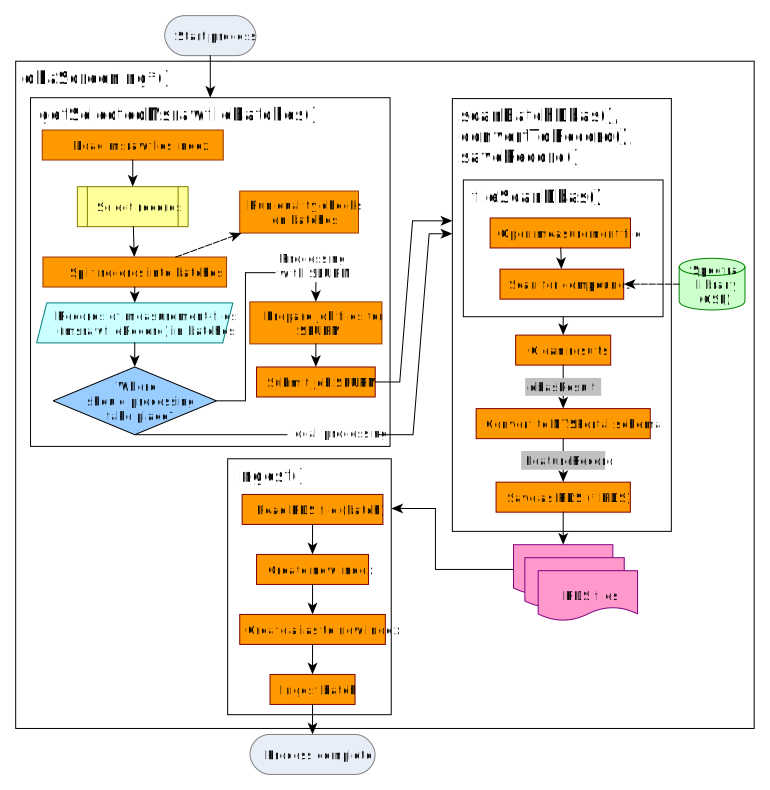
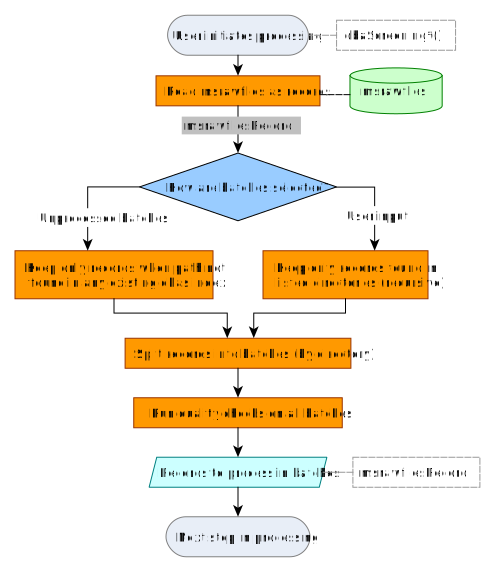

```{r, include = FALSE}
knitr::opts_chunk$set(
  collapse = TRUE,
  comment = "#>"
)
```

# Introduction

Measurement files are processed using the library screening algorithm known as DBAS. All the parameters for processing, as well as the location of the necessary input files, are stored in the `msrawfiles` index. The output is stored in a `dbas` index. See [naming conventions of indices](articles/Structure-of-NTSPortal.html).

# Reprocessing all datafiles in msrawfiles index

After additions have been made to the spectral library all datafiles must be reprocessed. After making necessary changes to the `msrawfiles` table, processing can be started with the various `dbaScreening*` functions depending on where the processing should take place (locally, server etc.). For example, `dbaScreeningSelectedBatchesSlurm()` is used to begin processing using the SLURM workload manager.

# Overview of processing algorithm

## Connecting to ElasticSearch cluster

Connection within the BfG is achieved in R using `connectNtsportal()`. This will use the stored credentials to build the connection (the `PythonDbComm` interface).

## General workflow

The HRMS measurement files are stored as mzXML files in the filesystem, in directories representing batches (measurement sequences). The files were previously converted from the vendor specific formats (.raw, .wiff, etc.) using *Proteowizard's* `msconvert`-tool. 

The `msrawfiles` table is used to manage the metadata. Each measurement file has a record in this table which contains information such as file's path, sampling and acquisition information and processing parameters.

The `msrawfile`-records are used to control the processing workflow. Once the workflow is complete, the data is saved as a JSON file in the format needed for Elasticsearch ingest (importing the data into Elasticsearch). The ingest itself is done in a separate step.

{width=100%}

### Process launching

The user runs one of several `dbaScreening*` functions to start the processing either locally or via SLURM. In `dbaScreeningSelectedBatchesSlurm()` (the most commonly used) specific directories (i.e. batches) containing the measurement files are passed either by listing them directly or by giving a root directory. Alternatively, the user can process any "new" batches using `dbaScreeningUnprocessedBatchesSlurm()` (Section [Collecting msrawfile records](#collecting-msrawfile-records)).

#### Processing using the workflow manager SLURM

To run the screening via SLURM, first the necessary job files are be created. The user then starts the processing by submitting the job file (.sbatch) to the workload manager.

{width=100%}

### Collecting msrawfile records {#sec-collectingMsrawfileRecords}
In `dbaScreeningUnprocessedBatchesSlurm()`, new batches are selected by looking at all `dbas` indices and comparing the files found (identified by the `path` field) to the files found in `msrawfiles`. Any batches in `msrawfiles` not yet found in any `dbas` index are selected for processing.

The `msrawfiles` records are loaded and checks performed before the scanning process begins. Output is a list of batches of `ntsportal::msrawfilesRecord`s. 

{width=100%}


### File-wise scanning
The measurement files are scanned for compounds in the spectral library and the results are cleaned. The result is one `dbasResult` object for the batch (`list` of `data.frame`s containing peak information for the whole batch). 

Table: `dbasResult` class

|Name of table|Comment|
|-------------|--------|
|`peakList`|Peaks detected with MS2|
|`reintegrationResults`|Peaks detected after gap-filling (with and without MS2)|
|`rawFilePaths`||
|`ms1Table`|MS spectra|
|`ms2Table`|MS2 spectra|
|`eicTable`|Extracted ion chromatograms|
|`isResults`|Internal standard peaks|


### Conversion to `featureRecord`

The results from scanning (`dbasResult`) are converted to a `list` format for later import into NTSportal (`featureRecord`). Additional compound information is taken from the spectral library and measurement file metadata is taken from `msrawfiles` and added to each record. MS^1^, MS^2^ spectra and the EIC of the peak are added if available (only peaks in `dbasResult$peakList` have these data available).

{width=100%}

### Writing RDS for database import

The list of `featureRecord` objects from one batch are saved in an RDS file (using the default `gzip` compression). 

### Database import (ingest)

Before ingesting documents, the user must ensure that the enrich policies and ingest pipelines are up to date. This is done with `updateEnrichPolicies()`, which will synchronize Elasticsearch with the current enrich policies and ingest pipelines needed for ntsportal.

The RDS files are imported into NTSPortal with `ingest()`, which calls the Elasticsearch bulk ingest API via Python. The user runs `ingest()` separately after processing is complete. The ingest includes a pipeline (`ingest-feature`) which enriches each document with sample metadata found in `msrawfiles`. These are the fields such as sampling location and sampling time, `loc` and `start` fields, respectively. 

{width=100%}

