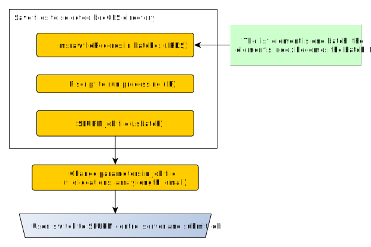

```{r, include = FALSE}
knitr::opts_chunk$set(
  collapse = TRUE,
  comment = "#>"
)
```

# Introduction

Measurement files are processed using the library screening algorithm known as DBAS. All the parameters for processing, as well as the location of the necessary input files, are stored in the `msrawfiles` index. The output is stored in a dbas index. See [naming conventions of indices](https://github.com/bafg-bund/ntsportal/wiki/Structure-of-NTSPortal#index-naming-conventions).

# Reprocessing all datafiles in msrawfiles index

After additions have been made to the spectral library all datafiles must be reprocessed. After making necessary changes to the `msrawfiles` table, processing can be started with the various `dbaScreening*` functions depending on where the processing should take place (locally, server etc.). For example, `dbaScreeningSelectedBatchesSlurm` is used to begin processing using the SLURM workload manager.

# Overview of processing algorithm

## Connecting to ElasticSearch cluster

Connection within the BfG is achieved in R using the `connectNtsp()` function. This will use the stored credentials (stored in `keyring` with the file back-end) to build the connection (connection details are used to create the `escon` interface for use with the R-package `elastic` or are used to build the `PythonDbComm` interface).

## General workflow

The HRMS measurement files are stored in the filesystem in directories representing batches (measurement sequences). The msrawfiles index is used to manage the metadata. Each file has a record which contains information such as file location, sampling information and processing parameters.

The msrawfile-records are used to control the processing workflow. Once the workflow is complete, the data is saved as a json file in the format needed for Elasticsearch ingest. The ingest is done in a separate step.

{width=100%}

### Process launching

The user runs a function to start the screening either locally or via SLURM. In this function the batches to process are either selected by passing specific directories either by listing them directly or by giving a root directory.

Alternatively the user can process any "new" batches

#### Processing using the workflow manager SLURM

To run the screening via SLURM, first the necessary job files are generated. The user must then start the actual processing by submitting the job file (.sbatch) to the workload manager.

{#fig-slurmSubmission width=100%}

### Collecting msrawfile-records {#sec-collectingMsrawfileRecords}
New batches are selected based by looking at all feature indices and comparing this to msrawfiles. Any batches in msrawfiles not yet found in any feature index (based on presence of the directory in the `path` field) are processed.

The msrawfile records are loaded and checks performed before the scanning process begins. Output is a list of batches of `ntsportal::msrawfileRecord`s. See @sec-batchSelection. 

{width=100%}


### File-wise scanning
The measurement files are scanned and cleaned using different algorithms. Currently "dbas" is in development. The result is one `ntsportal::dbasResult` object for the batch (list containing peak tables for the whole batch). 

|Name of table|Comment|
|-------------|--------|
|peakList|Peaks detected with MS2|
|reintegrationResults|Peaks detected after gap-filling (with and without MS2)|
|rawFilePaths||
|ms1Table||
|ms2Table||
|eicTable||
|isResults||


### Conversion to ntsportal "feature" format

The results from scanning and cleaning are converted to a list format for ntsportal. Output is a list of `ntsportal::featureRecord`s. This essentially involves converting the feature table to a list of record objects. Compound and sample information (measurement file metadata) is added to each record, as well as MS1, MS2 spectra and the EIC of the peak.

{width=100%}

### Writing json for database import (ingest)

The list of `featureRecord` objects are saved in a json file and compressed with gzip (json.gz file). 

### Database import (ingest)

The json files are ingested via `ingestJson` which calls python functions. The user must run this function separately after processing is complete.

{width=100%}

