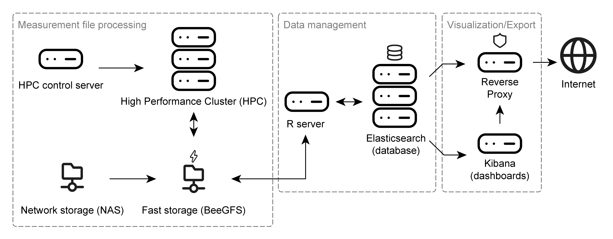

```{r, include = FALSE}
knitr::opts_chunk$set(
  collapse = TRUE,
  comment = "#>"
)
```

# Software architecture

The NTSPortal system is made up of many components which can be grouped into three sections: 'measurement file processing', 'data management' and 'visualization'. The following dependency diagram gives an overview of the main, high-level, software components.

{width=100%}

# Hardware architecture

The hardware components used to run NTSPortal can be similarly categorized as the software. The core component of NTSPortal is a high-performance computing cluster (HPC) used for measurement file processing. This system consists of 7 compute nodes each with 64 CPUs and 503 GB of memory. The HPC is controlled by the HPC control server. Measurement files are stored on a network attached storage (NAS), which is synchronized with a fast, SSD-based storage (BeeGFS). The data management component consists of a separate server (R-server) and a 3-node cluster running Elasticsearch (containerized). The visualization component is accomplished with a server hosting the dashboards (Kibana). All traffic to and from the Internet runs through a reverse proxy for IT security reasons. All servers are virtualized and run Rocky Linux 8.10 and the Elasticsearch cluster, R and Kibana servers run on an HCI (hyper-converged infrastructure).

{width=100%}

# Index mappings (DB Schema)

ElasticSearch uses indices to store data. NTSPortal contains different index types, each with a different structure. 

The mapping code and field descriptions for the different tables: 

- [`dbas`](https://github.com/bafg-bund/ntsportal/tree/main/inst/mappings/dbas_index_mappings.json) (results of library screening data processing)
- [`msrawfiles`](https://github.com/bafg-bund/ntsportal/tree/main/inst/mappings/msrawfiles_index_mappings.json) (metadata and processing parameters for measurement files)
- [`analysis_dbas`](https://github.com/bafg-bund/ntsportal/tree/main/inst/mappings/analysis_dbas_index_mappings.json) (summary statistics for dbas)
- [`spectral_library`](https://github.com/bafg-bund/ntsportal/tree/main/inst/mappings/spectral_library_index_mappings.json) (copy of collective spectral library - CSL)

# Index naming conventions

The indices are named using the convention:  
`ntsp<version number>_index_<index type>_v<ingest time 'YYMMDDHHmmSS'>_<project or institute>`

For example: `ntsp25.2_index_analysis_dbas_v240215101520_bfg`, `ntsp25.2_index_nts_v240316101520_lanuv`

There are defined codes for project or institute.

## Exceptions
For the index types `msrawfiles` and `spectral_library` there is only one index and there is no alias, so are just called `ntsp25.2_msrawfiles` or `ntsp25.2_spectral_library`.

Each other index type can have any number of indices, for a particular project, institute or other subset of data.

# Aliases

ElasticSearch uses aliases to make accessing an index easier. These names are designed to be shorter and not to change. They point to an index. The aliases have the following naming convention:  
`ntsp<version number>_<index type>_<project or institute>`

For example: `ntsp25.2_dbas_bfg`

The alias will point to the current version of the index. This way, several versions of an index can be maintained concurrently for testing and backup purposes.

# Data views

Kibana uses data views to allow for granular data access rights. A data view is a name pattern potentially matching one or several indices (or aliases). A user has a role, and each role is given access to specific indices. The dashboards in Kibana are built with data views so that they are programmed only once and the users role determines which indices are visible in the dashboard. 

An example of a data view is: `ntsp25.2_dbas*`. This data view will access both the aliases `ntsp25.2_dbas_bfg` and `ntsp25.2_dbas_lanuv`, for example. So that a user with the role `ntsp_lanuv`, which has access to both aliases and therefore the linked indices, will see both datasets when viewing a dashboard visual using that data view. 

It is important that alias names are not a subset of each other or indices. So the `ntsp_is_dbas` alias is correct while `ntsp_dbas_is` is incorrect. This is because this second alias would also match the data view `ntsp_dbas*` and therefore the internal standard data would appear together with the results.  

The following table shows some examples of the naming conventions

|Index|Alias|Data view|
|-----|-----|---------|
|ntsp25.2_index_dbas_v240418101520_bfg|ntsp25.2_dbas_bfg|ntsp25.2_dbas*|
|ntsp25.2_index_dbas_v240422101520_bfg|ntsp25.2_dbas_bfg|ntsp25.2_dbas*|
|ntsp25.2_spectral_library|-|ntsp25.2_spectral_library*|
|ntsp25.2_index_analysis_dbas_v240418101520_upb|ntsp25.2_analysis_dbas_upb|ntsp25.2_analysis_dbas*|
|ntsp25.2_msrawfiles|-|ntsp25.2_msrawfiles*|
|ntsp25.2_index_is_dbas_v240218101520_bfg|ntsp25.2_is_dbas_bfg|ntsp25.2_is_dbas*|
|ntsp25.2_index_nts_v240428101520_unit_tests|ntsp25.2_nts_unit_tests|-|
|ntsp25.2_index_test_dbas_v250408101520_bfg|ntsp25.2_test_dbas_bfg|ntsp25.2_test_dbas*|


