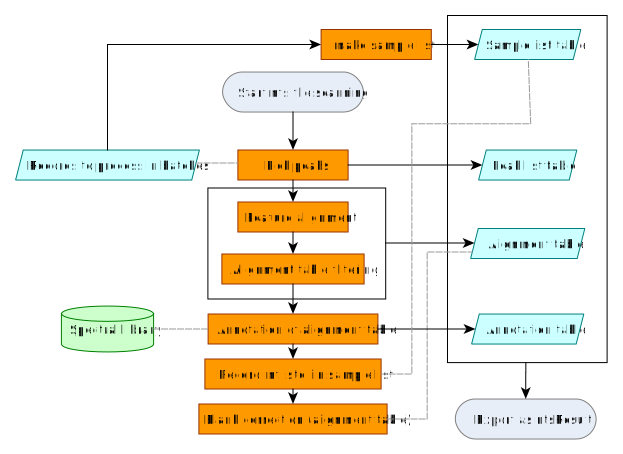
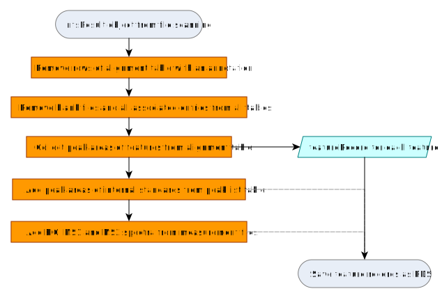

```{r, include = FALSE}
knitr::opts_chunk$set(
  collapse = TRUE,
  comment = "#>"
)
```

# Introduction

Measurement files are processed by two algorithms in NTSPortal, [library screening](articles/processing-by-library-screening.html) (`dbas`) and non-target screening (`nts`), the later is described here. The results of both processing algorithms are stored in `feature` tables in Elasticsearch. Processing by `nts` only includes features without a compound match in the CSL (i.e. unknowns). To achieve this, `nts` processing includes an annotation step, but annotated features (i.e. with a match in the CSL) are removed from the final feature list (during the conversion to `featureRecord` step). This removal does not include all possible adducts, in-source fragments or isotopogues of a compound, since the CSL can not include all possible permutations. Therefore, there may still be some duplication in the results. 

Processing by `nts` works analogously to `dbas` and can be started with the same various `screening*()` functions using `nts` as the `screeningType` argument. The rest is the same as `dbas`: Results are converted to a `list` of `featureRecord`s and saved as `.RDS` files. These are imported into the database using `ingestFeatureRecords()`.

# Workflow details

## File scanning

Files are processed together in batches. The processing algorithm using functions provided by `ntsworkflow` and performs the following steps:

1. **Peak-picking:** An initial feature list is built by searching EICs for chromatographic peaks
3. **Feature alignment:** Features are grouped across samples (m/z and $t_R$ similarity), building the alignment table
4. **Alignment table cleaning:** The alignment table is filtered by different means, e.g. only keeping features found repeatedly in replicate injections.
5. **Annotation with the CSL:** Using m/z, $t_R$ and MS² matching with with collective spectral library
6. **Internal standards marked:** The IDs of internal standards are recorded in the sample list (for building the `featureRecord`).
7. **Blank correction:** Features found in samples and field blanks (background) are removed from the alignment table. Internal standards are included in the field blank so they are also removed from the alignment table in this step (however, they remain in the peak list).

The result of this processing is a `ntsResult` object, a `list` containing 4 tables (`tbl_df` objects).

|Name of table|Comment|
|-------------|--------|
|`peakList`|Peaks (features) detected|
|`sampleList`|Table of measurement files and associated metadata|
|`alignmentTable`|Table of aligned features|
|`annotationTable`|Table of annotations of the `alignmentTable` (matches with the CSL)|

Table: This is a test caption

{width=80%}

## Conversion to `featureRecord`

The `ntsResult` object is converted to a `featureRecord` using a method of the `convertToRecord()` generic. It includes the following steps:

1. Annotated rows of the `alignmentTable` (those features with a match in the CSL) are removed.
2. Blank files and all associated features and data are removed.
3. Peak areas of all features are collected from the `alignmentTable`.
4. Peak areas of internal standard features are gathered from the `peakList`. These were removed from the alignment table during step 7 of file scanning (but remained in the peak list table). The IDs were recorded in step 6 of file scanning.
5. `featureRecord`s are enriched with EICs, MS1 and MS2 spectra, which are collected from the raw measurement files.
6. The list of `featureRecord`s is saved as a `.RDS` file.

{width=80%}

Each `featureRecord` also includes the path to the measurement file (to reference the `msrawfiles` entry and all the associated metadata) and the feature table alias, which is used to create the feature table in Elasticsearch.

The `featureRecord`s are collected in a `list` and saved as one RDS file per batch.

<!-- Copyright 2026 Bundesanstalt für Gewässerkunde -->
<!-- This file is part of ntsportal -->