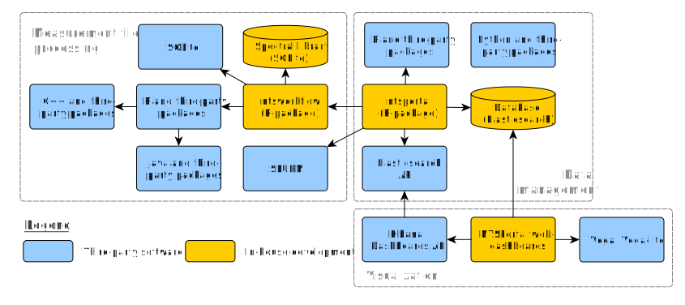
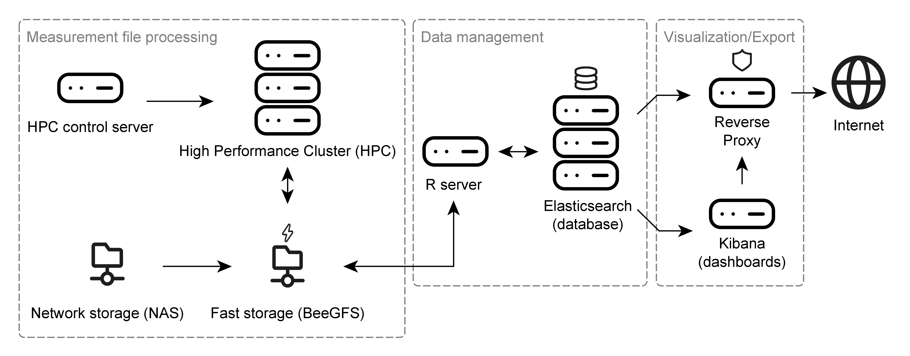

```{r, include = FALSE}
knitr::opts_chunk$set(
  collapse = TRUE,
  comment = "#>"
)
```

# Software architecture

The NTSPortal system is made up of many components which can be grouped into three sections: 'measurement file processing', 'data management' and 'visualization'. The following dependency diagram gives an overview of the main, high-level, software components.

{width=100%}

`ntsportal` is tested with the following versions of each software component. Only the upper level dependencies are listed.

|Software Component|Version|Description|
|:-----------------|:------|:----------------------------------------------|
|R|4.5.2|High level scripting, db management|
|Python|3.12.11|Interface to Elasticsearch using Python package "elasticsearch"|
|Elasticsearch|8.18.8|Database and search engine|
|Kibana|8.18.8|Content management system|
|ntsworkflow|0.2.9|R package for processing|
|xcms|4.8.0|R package for interfacing with mzXML files|
|Spectral library (CSL)|25.5|Library for MS2 spectra|
|Vega, vega-lite|v5|Custom graphics in Kibana|
|rJava|1.0-11|R package interface to Java|
|Java|1.8.0_472|openJDK is used for Java|
|Rocky Linux|8.10|Operating system for servers|

: Table: Versions of software components

# Hardware architecture

The hardware components used to run NTSPortal can be similarly categorized as the software. The core component of NTSPortal is a high-performance computing cluster (HPC) used for measurement file processing. This system consists of 7 compute nodes each with 64 CPUs and 503 GB of memory. The HPC is controlled by the HPC control server. Measurement files are stored on a network attached storage (NAS), which is synchronized with a fast, SSD-based storage (BeeGFS). The data management component consists of a separate server (R-server) and a 3-node cluster running Elasticsearch (containerized). The visualization component is accomplished with a server hosting the dashboards (Kibana). All traffic to and from the Internet runs through a reverse proxy for IT security reasons. All servers are virtualized and run Rocky Linux 8.10 and the Elasticsearch cluster, R and Kibana servers run on an HCI (hyper-converged infrastructure).

{width=100%}

# Index mappings (DB Schema)

ElasticSearch uses **tables** to store data, these are known in Elasticsearch as indices. In NTSPortal the term table is preferably used. The rows in each table are referred to as either documents or rows and the column headers of each table are referred to as **fields**. NTSPortal contains 5 different table structures to hold different data. The field names and descriptions are described in [Document field descriptions for NTSPortal](articles/table-mappings.html). 

- `feature` tables contain the results of processing, either by library screening (`dbas`) or non-target screening (`nts`).
- `msrawfiles` table (only one) contains metadata and processing parameters for measurement files (for both types of processing)
- `analysis_dbas` tables contain summary statistics for `dbas` (currently only holds summary data for `spm` samples from the Environmental Specimen Bank)
- `spectral_library` table (only one) is a copy of collective spectral library (CSL)
- `nondectect_dbas` tables list all compounds in the CSL that were **not** detected in a sample by `dbas` processing.

# Table naming conventions

The tables in NTSPortal are named using the convention:  
`ntsp<version number>_index_<table type>_v<ingest time 'YYMMDDHHmmSS'>_<project or institute>`

For example: `ntsp25.3_index_analysis_dbas_v240215101520_upb`, `ntsp25.3_index_feature_v240316101520_lanuv`

The ingest time is when the data was loaded into the database. There are defined codes for each project or institute. This code is used to manage the data access for each user.

## Exceptions
For the index types `msrawfiles` and `spectral_library` there is only one table and there is no alias, so these are just called `ntsp25.3_msrawfiles` or `ntsp25.3_spectral_library`.

# Aliases

ElasticSearch uses aliases to manage access to a table. These are just links to a table and are designed to be shorter and not to change. The aliases have the following naming convention:  
`ntsp<version number>_<table type>_<project or institute>`

For example: `ntsp25.3_dbas_bfg`

One alias includes all tables from different ingest times. Since the types `msrawfiles` and `spectral_library` only have one table each, there is no need for aliases.

# Data views

Kibana uses data views to allow for granular data access rights. A data view is a name pattern potentially matching one or several indices (or aliases). A user has a role, and each role is given access to specific indices. The dashboards in Kibana are built with data views so that they are programmed only once and the users role determines which indices are visible in the dashboard. 

An example of a data view is: `ntsp25.3_feature*`. This data view will access both the aliases `ntsp25.3_feature_bfg` and `ntsp25.3_feature_lanuv`, for example, via the wildcard (`*`) expansion. So a user with the role `ntsp_lanuv`, which has access to both aliases and therefore the linked indices, will see both datasets when viewing a dashboard visual using that data view. Similarly, the API can also accept this wildcard notation for accessing tables.

It is important that alias names are not a subset of each other or indices. So, for example, the `ntsp_is_dbas` alias is correct while `ntsp_dbas_is` is incorrect. This is because this second alias would also match the data view `ntsp_dbas*` and therefore the internal standard data would appear together with the results.  

|Index|Alias|Data view|
|-----|-----|---------|
|ntsp25.3_index_feature_v240418101520_bfg|ntsp25.3_feature_bfg|ntsp25.3_feature*|
|ntsp25.3_index_feature_v240422101520_bfg|ntsp25.3_feature_bfg|ntsp25.3_feature*|
|ntsp25.3_spectral_library|-|ntsp25.3_spectral_library*|
|ntsp25.3_index_analysis_dbas_v240418101520_upb|ntsp25.3_analysis_dbas_upb|ntsp25.3_analysis_dbas*|
|ntsp25.3_msrawfiles|-|ntsp25.3_msrawfiles*|
|ntsp25.3_index_is_dbas_v240218101520_bfg|ntsp25.3_is_dbas_bfg|ntsp25.3_is_dbas*|
|ntsp25.3_index_test_dbas_v250408101520_bfg|ntsp25.3_test_dbas_bfg|ntsp25.3_test_dbas*|

: Table: Examples of table/index naming conventions

<!-- Copyright 2025 Bundesanstalt für Gewässerkunde -->
<!-- This file is part of ntsportal -->

